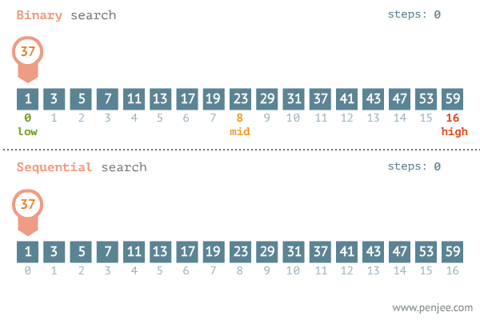

packages/runtime-core/src/getSequence.ts

<!-- more -->


## getSequence 函数

上次也说了 getSequence 函数的作用是尽可能减少数组的移动次数，从而达到最优性能。
他是通过二分查找方法 + 贪心算法来实现的。


### 贪心算法  
   是指从问题初始转状态出发，通过在每一步选择中都采取最好或者最优（最有利）的选择，从而得到结果的最优值
   贪心算法不仅操作直接、实现简单，而且通常效率也很高。但对于某些硬币面值组合，贪心算法并不能找到最优解

::: important 最经典的贪心算法题目

给定 `n` 种硬币
第 `i` 种硬币的面值为 `coins[i - 1]`
目标金额为 `amt`
每种硬币可以重复选取，
问能够凑出目标金额的最少硬币数量。如果无法凑出目标金额，则返回 `-1`

:::   

看上面的文字可能还有些迷糊，那就举一个简单的例子来解释一下这个问题              
**我们的目标是**需要使用最少数量的硬币来凑出 11 元。可以重复使用 1 元、2 元和 5 元的硬币
也就是`let coins = [1, 2, 5]` `let amt = 11` 
用了贪心算法的解题逻辑就是 先找到最大面值的，这是当前的最优解
那么第一步得出的金币是`5` `amt = 11 - 5 = 6`        
拿6对比1，2，5，发现1和2都比5小，所以第二步得出的金币是`5` `amt = 6 - 4 = 1`    
拿1和2都比5小，所以第三步得出的金币是`5` `amt = 1 - 1 = 0`  
答案是要出2个5元，和一个1元、所以最少需要3个硬币。

```js
/* 零钱兑换：贪心 */
function coinChangeGreedy(coins, amt) {
    // 假设 coins 数组有序
    let i = coins.length - 1;
    let count = 0;
    // 循环进行贪心选择，直到无剩余金额
    while (amt > 0) {
        // 找到小于且最接近剩余金额的硬币
        while (i > 0 && coins[i] > amt) {
            i--;
        }
        // 选择 coins[i]
        amt -= coins[i];
        count++;
    }
    // 若未找到可行方案，则返回 -1
    return amt === 0 ? count : -1;
}
```

### 二分查找法

基于分治策略的高效搜索算法。它利用数据的有序性，每轮缩小一半搜索范围，直至找到目标元素或搜索区间为空为止



```js
/* 二分查找（双闭区间） */
function binarySearch(nums, target) {
    // 初始化双闭区间 [0, n-1] ，即 i, j 分别指向数组首元素、尾元素
    let i = 0,
        j = nums.length - 1;
    // 循环，当搜索区间为空时跳出（当 i > j 时为空）
    while (i <= j) {
        // 计算中点索引 m ，使用 parseInt() 向下取整
        const m = parseInt(i + (j - i) / 2);
        if (nums[m] < target)
            // 此情况说明 target 在区间 [m+1, j] 中
            i = m + 1;
        else if (nums[m] > target)
            // 此情况说明 target 在区间 [i, m-1] 中
            j = m - 1;
        else return m; // 找到目标元素，返回其索引
    }
    // 未找到目标元素，返回 -1
    return -1;
}
```

### renderer 函数的运行逻辑

::: tabs
@tab packages/shared/src/getSequence.ts

```ts
export function getSequence(arr) {
  // 贪心算法和二分查找
  const result = [0] //结果集 从0开始
  let len = arr.length //数组长度
  const p = arr.slice(0)
  for (let i = 1; i < len; i++) {
    const arrI = arr[i] //当前项
    if (arrI !== 0) {
      //如果数值存在0说明没有被 patch 过是创建节点
      //为了vue3处理了数组中0的情况
      let resultLastIndex = result[result.length - 1] //拿出结果集的最后一项和当前数据比对
      if (arr[resultLastIndex] < arrI) {
        //索引小于当前一项
        p[i] = resultLastIndex // 标记当前前一个对应的索引
        result.push(i).toFixed
        continue //下一次循环
      }
      // 二分查找 结果索引是递增的，使用二分查找可以优化性能
      let start = 0
      let end = result.length - 1
      while (start < end) {
        let mid = Math.floor(start + (end - start) / 2) //获取中间值的向下取整 index
        console.log('arr[result[mid]]=>', arr[result[mid]])
        if (arr[result[mid]] < arrI) {
          // 如果中间值小于当前值，说明应该在它后面，就去找后面
          start = mid + 1
        } else {
          // 如果b[result[mid]]大于当前值，说明应该在它前面，就去找前面
          end = mid
        }
      }

      if (arrI < arr[result[start]]) {
        if (start > 0) {
          // 才需要替换 如果当前值小于它前  一个，那么它应该替换前一个
          p[i] = result[start - 1] // 要将他替换的前一个记住
        }
        // 替换
        result[start] = i
      }
    }
  }

  let i = result.length - 1
  let last = result[result.length - 1]

  while (i >= 0) {
    result[i] = last
    last = p[last]
    i--
  }
  return result
}

// [0 1 2 ]

console.log(getSequence([2, 3, 1, 5, 6, 8, 7, 9, 4]))
```

:::
