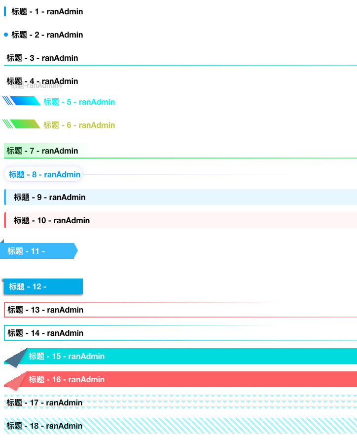

# 好看的 title 样式

<!-- more -->



```html
<template>
  <div class="titleContent">
    <div :class="'title  title'+value" :data-text="'标题-ranAdmin'+value" v-for="value in 18" :key="value">标题-ranAdmin</div>
  </div>
</template>
<style lang="scss">
  .titleContent {
    div {
      margin: 15px;
    }
  }
  .title {
    height: 32px;
    font-weight: 600;
    line-height: 32px;
    margin-left: 5px;
    padding-left: 5px;
    position: relative;
    color: #000;
    z-index: 0;
  }
  .title1 {
    padding-left: 15px;
    &:after {
      content: ' ';
      width: 4px;
      height: 20px;
      background: #12a3f5;
      position: absolute;
      left: 0;
      top: 6px;
      border-radius: 2px;
    }
  }
  .title2 {
    padding-left: 15px;
    &:after {
      content: ' ';
      width: 8px;
      height: 8px;
      border-radius: 50%;
      background: #12a3f5;
      position: absolute;
      left: 0;
      top: 12px;
    }
  }
  .title3 {
    &:after {
      content: ' ';
      position: absolute;
      bottom: 0;
      left: 0;
      position: absolute;
      height: 2px;
      width: 100%;
      background: linear-gradient(to right, #01dfe3, rgba(255, 255, 255, 0));
    }
  }
  .title4 {
    &:after {
      content: attr(data-text);
      position: absolute;
      display: inline-block;
      bottom: -8px;
      left: 5px;
      opacity: 0.2;
      z-index: 0;
      text-align: right;
      transform: rotateY(30deg);
      transform: scaleY(30deg);
    }
  }
  .title5 {
    color: #10faf8;
    padding-left: 80px;
    line-height: 22px;
    position: relative;
    border-bottom: 2px solid linear-gradient(to right, #01dfe3, rgba(255, 255, 255, 0));
    &:after {
      content: '';
      position: absolute;
      bottom: 0;
      top: 0;
      left: 18px;
      width: 50px;
      height: 18px;
      transform: skewX(35deg);
      background: linear-gradient(to right, #2d83fa, #10faf8);
    }
    &:before {
      content: '|||';
      display: inline-block;
      font-weight: 900;
      color: #fff;
      line-height: 30px;
      font-size: 18px;
      position: absolute;
      position: absolute;
      top: -8px;
      left: 0;
      color: #2d83fa;
      transform: skewX(35deg);
    }
  }
  .title6 {
    color: #c6d039;
    padding-left: 80px;
    line-height: 22px;
    position: relative;
    border-bottom: 2px solid linear-gradient(to right, #01dfe3, rgba(255, 255, 255, 0));
    &:after {
      content: '';
      position: absolute;
      bottom: 0;
      top: 0;
      left: 18px;
      width: 50px;
      height: 18px;
      transform: skewX(35deg);
      background: linear-gradient(to right, #4bf15a, #c6d039);
    }
    &:before {
      content: '|||';
      display: inline-block;
      font-weight: 900;
      color: #fff;
      line-height: 30px;
      font-size: 18px;
      position: absolute;
      position: absolute;
      top: -8px;
      left: 0;
      color: #4bf15a;
      transform: skewX(35deg);
    }
  }
  .title7 {
    &:after {
      content: '';
      position: absolute;
      bottom: 0;
      top: 0;
      left: 0;
      width: 180px;
      height: 100%;
      opacity: 0.3;
      background: linear-gradient(to right, #4bf15a, #4bf15900);
    }
    &:before {
      content: ' ';
      position: absolute;
      bottom: 0;
      left: 0;
      position: absolute;
      height: 2px;
      width: 100%;
      background: linear-gradient(to right, #4bf15a, rgba(255, 255, 255, 0));
    }
  }
  .title8 {
    border-radius: 16px;
    border: 1px solid #e8e9fb;
    box-shadow: 0 0 10px #e8e9fb;
    text-align: center;
    width: 160px;
    color: #12a3f5;
    &:before {
      content: '';
      width: 300%;
      height: 2px;
      background: #e8e9fb;
      position: absolute;
      top: 15px;
      left: 100%;
      background: linear-gradient(to right, #e8e9fb, rgba(255, 255, 255, 0));
    }
  }
  .title9 {
    background: #ecf8ff;
    border-top-left-radius: 5px;
    padding-left: 20px;
    &:before {
      content: '';
      border-top-left-radius: 5px;
      border-bottom-left-radius: 5px;
      width: 4px;
      height: 100%;
      background: #50bfff;
      position: absolute;
      top: 0;
      left: 0;
    }
  }
  .title10 {
    background: #fff6f7;
    border-top-left-radius: 5px;
    padding-left: 20px;
    &:before {
      content: '';
      border-top-left-radius: 5px;
      border-bottom-left-radius: 5px;
      width: 4px;
      height: 100%;
      background: #fe6c6f;
      position: absolute;
      top: 0;
      left: 0;
    }
  }
  .title11 {
    display: inline-block;
    position: relative;
    width: 150px;
    height: 32px;
    line-height: 32px;
    padding-left: 15px;
    background: #50bfff;
    left: -8px;
    color: #fff;
    &:before {
      content: '';
      position: absolute;
      height: 0;
      width: 0;
      border-bottom: 8px solid #4396c5;
      border-left: 8px solid transparent;
      top: -8px;
      left: 0;
    }
    &:after {
      content: '';
      position: absolute;
      height: 0;
      width: 0;
      border-top: 15px solid transparent;
      border-bottom: 15px solid transparent;
      border-left: 8px solid #50bfff;
      right: -8px;
      top: 0;
    }
  }
  .title12 {
    position: relative;
    width: 160px;
    padding-left: 10px;
    background: #00b3ed;
    box-shadow: -1px 2px 4px rgba(0, 0, 0, 0.5);
    color: #fff;
    &:before {
      position: absolute;
      content: '';
      display: block;
      width: 7px;
      height: 100%;
      padding: 0 0 7px;
      top: 0;
      left: -7px;
      background: inherit;
      border-radius: 5px 0 0 5px;
    }
    &:before {
      position: absolute;
      content: '';
      display: block;
      width: 5px;
      height: 5px;
      background: rgba(0, 0, 0, 0.35);
      bottom: -5px;
      left: -5px;
      border-radius: 5px 0 0 5px;
    }
  }
  .title13 {
    border-left: 2px solid #fe6c6f;
    &:after {
      content: ' ';
      position: absolute;
      bottom: 0;
      left: 0;
      position: absolute;
      height: 2px;
      width: 60%;
      background: linear-gradient(to right, #fe6c6f, rgba(255, 255, 255, 0));
    }
    &::before {
      content: ' ';
      position: absolute;
      top: 0;
      left: 0;
      position: absolute;
      height: 2px;
      width: 30%;
      background: linear-gradient(to right, #fe6c6f, rgba(255, 255, 255, 0));
    }
  }
  .title14 {
    border-left: 2px solid #01dfe3;
    &:after {
      content: ' ';
      position: absolute;
      bottom: 0;
      left: 0;
      position: absolute;
      height: 2px;
      width: 60%;
      background: linear-gradient(to right, #01dfe3, rgba(255, 255, 255, 0));
    }
    &::before {
      content: ' ';
      position: absolute;
      top: 0;
      left: 0;
      position: absolute;
      height: 2px;
      width: 30%;
      background: linear-gradient(to right, #01dfe3, rgba(255, 255, 255, 0));
    }
  }
  .title15 {
    color: #fff;
    padding-left: 50px;
    background: linear-gradient(-210deg, transparent 1.5em, #01dfe3 0);
    &::before {
      content: '';
      display: block;
      width: 1.73em;
      height: 3em;
      position: absolute;
      background: linear-gradient(-60deg, #577b98 50%, transparent 0);
      left: -3px;
      top: 0;
      border-bottom-left-radius: inherit;
      transform: translateY(-0.5em) rotate(30deg);
      transform-origin: bottom right;
      box-shadow: 0.2em 0.2em 0.3em -0.1em rgba(0, 0, 0, 0.15);
    }
  }
  .title16 {
    color: #fff;
    padding-left: 50px;
    background: linear-gradient(-210deg, transparent 1.5em, #fe6c6f 0);
    &::before {
      content: '';
      display: block;
      width: 1.73em;
      height: 3em;
      position: absolute;
      background: linear-gradient(-60deg, #f18384 50%, transparent 0);
      left: -3px;
      top: 0;
      border-bottom-left-radius: inherit;
      transform: translateY(-0.5em) rotate(30deg);
      transform-origin: bottom right;
      box-shadow: 0.2em 0.2em 0.3em -0.1em rgba(0, 0, 0, 0.15);
    }
  }
  .title17 {
    &:after {
      content: ' ';
      position: absolute;
      bottom: 0;
      left: 0;
      position: absolute;
      height: 100%;
      width: 100%;
      animation: animation3 1s linear infinite;
      background: linear-gradient(135deg, #01dfe3 0.25em, transparent 0.25em) -0.5em 0, linear-gradient(225deg, #01dfe3 0.25em, transparent 0.25em) -0.5em 0, linear-gradient(315deg, rgba(238, 161, 99, 0.25) 0.25em, transparent 0.25em) 0 0, linear-gradient(
            45deg,
            rgba(238, 161, 99, 0.25) 0.25em,
            transparent 0.25em
          ) 0 0;
      background-size: 0.75em 0.75em;
      opacity: 0.3;
    }
  }
  .title18 {
    &:after {
      content: ' ';
      position: absolute;
      bottom: 0;
      left: 0;
      position: absolute;
      height: 100%;
      width: 100%;
      opacity: 0.3;
      animation: animation2 1s linear infinite;
      background: repeating-linear-gradient(45deg, #01dfe3 0, #01dfe3 0.25em, transparent 0.25em, transparent 0.5em);
      background-size: 0.75em 0.75em;
    }
  }
</style>
```
