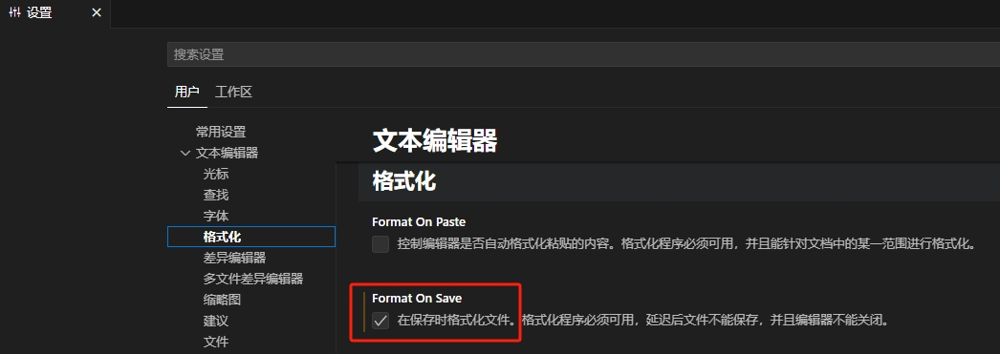

# vscode编辑器相关

## 一、vscode拓展

Chinese (Simplified)

beautify

Auto Close Tag

Atuo Rename Tag

vscode-icons

Path Intellisense

jQuery Code Snippets

Vetur

Live Server

Reactjs code snippets

## 二、vscode 设置相关

### 1.保存（Ctrl s）时既格式化代码

左下角 管理-设置



### 2.快捷生成vue模板页面

编辑器右下角管理-用户代码片段-vue.json

```json
{
 "Print to console": {
  "prefix": "vue",
  "body": [
   "<template>",
   "  <div></div>",
   "</template>",
   "",
   "<script>",
   "export default {",
   "  data () {",
   "    return {",
   "      ",
   "    };",
   "  },",
   "  components: {},",
   "  mounted () {},",
   "  created () {},",
   "  methods: {}",
   "}",
   "</script>",
   "",
   "<style lang='less' scoped>",
   "</style>"
  ],
  "description": "Log output to console"
 }
}
```
