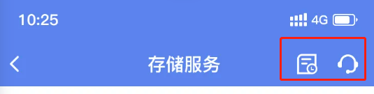
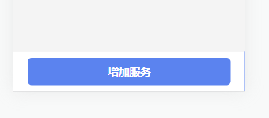
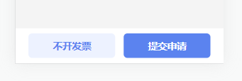
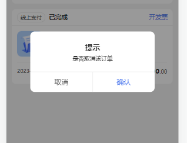
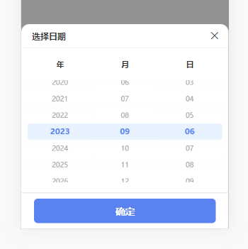
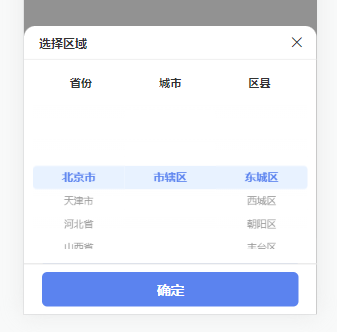
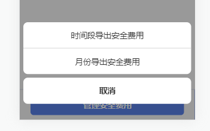
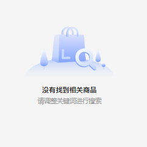

# 公共组件

## icon图标

创建者：lhf

一、



二、使用

```vue
<sz-icon iconName="icon-a-jianqu3" className="icon-add" size="32" color="#999"></sz-icon>
```

```css
.icon-add{
 margin-left: 40rpx;
    font-weight: bold;
}
```

三、备注

iconName：必传参数，为icon的名称。注意没有符号#！（icon名称在这里复制   /static/iconfont/demo_index.html   =》Symbol）

className：非必传参数，为icon的样式，如可以设置字体大小，颜色等。

size：非必传参数，默认为30，字体大小，单位rpx

color：颜色

## 顶部导航

一、


二、

```vue
  <sz-nav-bar title="导航标题">
   <view slot="right-area">
    <sz-icon iconName="icon-kefu" size="40" color="#fff" @click="toPage('/xxxx')"></sz-icon>
   </view>
  </sz-nav-bar>
```

三、备注

title：导航标题

bgColor：背景颜色：默认#5B83EF

textColor：文字颜色，默认#fff

left-area、right-area：左右的插槽名称

## 底部按钮

一、





二、使用

```vue
<sz-bottom-button :bottom="true" :text="'导出'" @onTap="confirm"></sz-bottom-button>
<sz-bottom-button :bottom="true" :text="['不开发票','提交申请']" @onTap="confirm"></sz-bottom-button>
```

```js
   confirm(e){
    console.log(e)
    if(e=='left'){
    ...
    }else if(e=='right'){
    ...
    }
   },
```

三、备注

text：按钮文字，一个传字符串，两个传数组

textColor：文字颜色，默认['#FFFFFF','#5B83EF']

bottom：true       默认固定底部

buttonAntiShake：false       点击按钮时是否防抖，默认不防抖

## 确认弹窗

创建者: lsj

一、



二、使用

```vue
<sz-confirm ref="confirmPopup" @confirm="confirm" :title="'提示'" :content="'是否取消该订单'"></sz-confirm>
```

```js
   cancel(e, i) {
    this.$refs.confirmPopup.open('center')
   },
   confirm() {},
```

三、备注

title：弹窗标题

content：弹窗内容文字

@confirm：确认事件

quxiaoText：取消按钮文字

qurenText：同意按钮文字

打开弹窗：this.$refs.confirmPopup.open('center')

## 时间选择

一、



二、使用

```js
 <sz-date :ifButton="true" @tapdate="tapdate"></sz-date>
```

```js
tapdate(e){
 console.log(e) //2023-09-06
}
```

三、备注

type：弹窗模式 ，默认date，  date-日期到天 time-时间有时分 month-月份选择

text：未选择时提示文字

defaultDate：默认时间为空，就是当前时间

dateInterval：默认为空，时间区间 格式['2023-01-01','2023-01-08'],['2023-01-01'],['','2023-01-08']

## 地区选择

一、



二、使用

```vue
 <sz-area :ifButton='true' @taparea="taparea"></sz-area>
```

```js
   taparea(e){
    console.log(e)
   },
```

三、备注

quCode：默认地区code

text：未选择时提示文字

## 底部弹窗选择

创建者：lsj

一、



二、

```vue
  <sz-picker ref="confirmPopup" :type="contentObj.type" @confirm="confirm" :data="contentObj.data"
   :map="contentObj.map"></sz-picker>
```

```js
    contentObj: {
     data: [{
      text: '时间段导出安全费用',
      value: 2
     }, {
      text: '月份导出安全费用',
      value: 1
     }],
     active: 0,
     map: {
      text: 'text',
      value: 'value'
     },
     type: 'fixed'
    },
```

三、备注

type: 选择器类型, 类型String, 默认值: 'default', 可传入内容：'fixed'

开启弹窗：this.$refs.confirmPopup.open()

@confirm：事件选择

data:：列表数据

active：选中的值

map：字段映射

## 无数据展示

一、



二、使用

```vue
   <sz-no-data type="custom" image="no-cantfind" text="没有找到相关商品" height="215" width="375">
    <view slot="content">
     <view class="hinge">请调整关键词进行搜索 </view>
    </view>
   </sz-no-data>
```

三、备注

type：custom为自定义，默认default

image：文件名

text：标题文字

height、width：宽高

content：插槽名，标题文字下内容

## 表单标题

一、

二、使用

```vue
<sz-form-title leftText="甲方信息"></sz-form-title>
```

三、备注

leftText：标题文字

## 表单输入框

一、

二、使用

```vue
<sz-form-input required disabled leftText="公司名称" :value="'xxx公司'" ></sz-form-input>
```

三、备注
